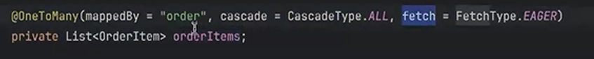

In this screenshot, the `cascade` keyword is from **Java Persistence API (JPA)** or **Hibernate**, used in entity relationships.


Here’s what’s happening:

---

### **`cascade = CascadeType.ALL`**

* **Meaning:** When you perform a certain operation on the parent entity (e.g., `Order`), that same operation will be automatically applied to the associated child entities (`OrderItem` in this case).
* `CascadeType.ALL` includes:

    * **PERSIST** – Saving the parent also saves the children.
    * **MERGE** – Merging the parent also merges the children.
    * **REMOVE** – Deleting the parent also deletes the children.
    * **REFRESH** – Refreshing the parent also refreshes the children.
    * **DETACH** – Detaching the parent also detaches the children.

**Example:**

```java
Order order = new Order();
order.addOrderItem(new OrderItem(...));
entityManager.persist(order); // Will also persist OrderItems automatically
```

Without `cascade`, you’d need to explicitly save each `OrderItem`.

---

### **`fetch = FetchType.EAGER`**

* This means that when you load an `Order` from the database, its `orderItems` list will also be loaded immediately, rather than lazily on first access.

---

So in your snippet:

```java
@OneToMany(mappedBy = "order", cascade = CascadeType.ALL, fetch = FetchType.EAGER)
private List<OrderItem> orderItems;
```

* The **cascade** makes child entities follow the parent's lifecycle changes.
* The **fetch** ensures children are loaded right away.

---

If you’d like, I can give you a **clear table** of all `CascadeType` values and when to use them in JPA. That would make the concept crystal clear.
