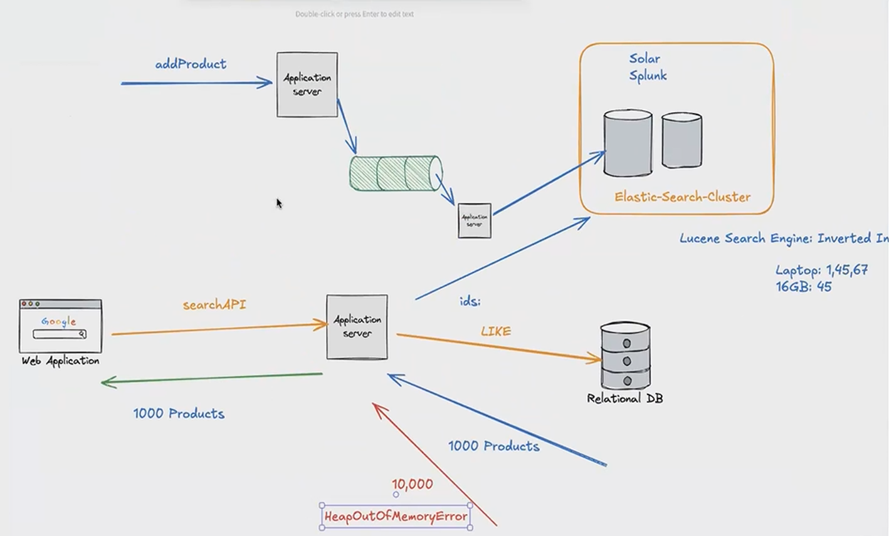

## **1. Adding a Product**

* **Flow:**
  `addProduct` → Application Server → (some queue or index pipeline) → Application Server → **ElasticSearch Cluster**
* This means when a product is added, it’s not just stored in a database — it’s also indexed in a **search engine** like **Solr**, **Splunk**, or **Elasticsearch**.
* **Reason:** Search engines like Elasticsearch use **Lucene’s inverted index** to make keyword searches super fast.

---

## **2. Searching for Products**

* A user from the **Web Application** calls `searchAPI`.
* The **Application Server** queries **Elasticsearch** (fast keyword matching) and gets a list of matching **product IDs**.
* These IDs are then used to query the **Relational Database** (using an SQL `LIKE` or `IN` query) to fetch full product details.

---

## **3. Result Size Problem**

* If the search matches **1,000 products**, the DB query fetches them, the Application Server holds them in memory, and sends them back to the user. This works fine.
* But if the search matches **10,000 products**:

    * The Application Server tries to load all into memory.
    * This can cause a **HeapOutOfMemoryError** in Java — the JVM doesn’t have enough memory to store them all at once.
    * Even if it fits in memory, sending huge responses is slow and inefficient.

---

## **4. Why Elasticsearch is Used**

* **Lucene Search Engine** uses an **inverted index**: instead of scanning all rows like SQL, it stores a mapping of terms → document IDs. This allows very fast retrieval.
* Example in diagram:

    * Keyword `Laptop` → IDs `[1, 45, 67]`
    * Keyword `16GB` → IDs `[45]`
* These IDs are then intersected to find products matching both keywords.

---

## **5. The Pagination Solution (Implied)**

This diagram is a classic case where **pagination** is needed:

* Instead of fetching **10,000 products at once**, return results in smaller chunks (e.g., 50 or 100 at a time).
* Use `LIMIT`/`OFFSET` in SQL or `from`/`size` in Elasticsearch to fetch partial results.
* This avoids:

    * Out-of-memory errors
    * Long response times
    * Unnecessary data transfer

---

✅ **In short:**
The diagram shows a search architecture where:

* Elasticsearch handles keyword search quickly.
* Relational DB stores detailed product data.
* Returning too many results at once can crash the backend — hence the need for **pagination** or lazy loading.

---

